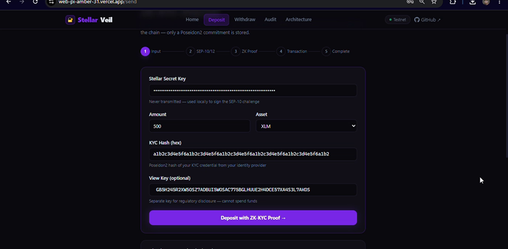
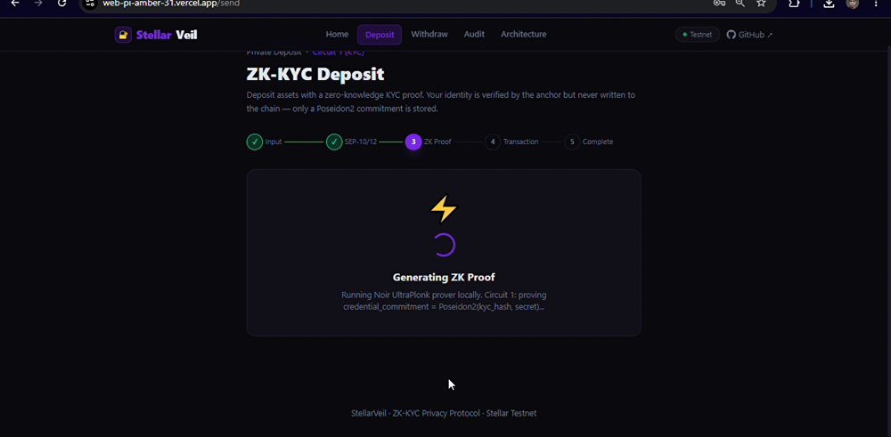
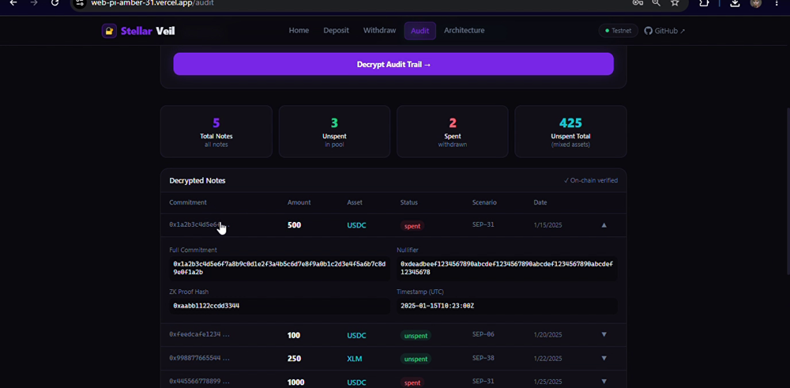
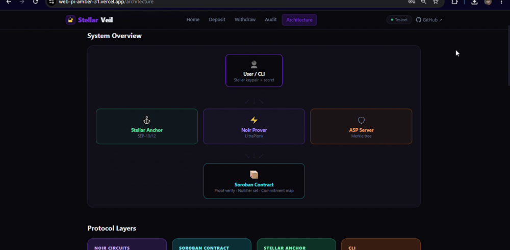

# StellarVeil

> ZK-private payment pool on Stellar — break the on-chain link between sender and receiver while remaining fully compliant.

[](./tests)
[](./circuits)
[](https://stellar.org)
[](./circuits)
[](./contracts/stellarveil)
[](https://github.com/stellar/stellar-protocol/blob/master/core/cap-0074.md)
[](https://web-pi-amber-31.vercel.app)
[](https://testanchor.stellar.org)
[](./LICENSE)

---

## The Problem

MoneyGram and YellowCard move **$55.6B/yr** on Stellar. Every payment is public. Sender, receiver, amount — visible to anyone with a block explorer. For remittance corridors (Nigeria → Philippines), payroll, and aid disbursements, this is a real privacy problem.

## What StellarVeil Does

Deposit USDC into a Soroban smart contract pool. Withdraw to any address using a zero-knowledge proof. The on-chain link between depositor and withdrawer is broken — but the system remains **fully compliant**:

- **zkKYC** — prove you're KYC'd without revealing who you are (live SEP-12 anchor integration)
- **ASP allowlist** — Association Set Provider compliance, mirrors SDF's own privacy-pools reference
- **View keys** — regulators decrypt specific tx amounts on demand, not all-or-nothing

## Demo Video

**[▶ Watch on YouTube](https://youtu.be/oG3Zm-DAYL0)**

## Live Demo

**[https://web-pi-amber-31.vercel.app](https://web-pi-amber-31.vercel.app)**

## Screenshots

<table>
<tr>
<td align="center" width="50%">
<br/>
<em>ZK-KYC deposit — enter secret, amount, KYC hash, and view key. Identity never leaves the client.</em>
</td>
<td align="center" width="50%">
<br/>
<em>Noir UltraPlonk proof generation (Circuit 1 — zkKYC). Commitment computed off-chain before hitting Soroban.</em>
</td>
</tr>
<tr>
<td align="center" width="50%">
<br/>
<em>Selective audit trail — view key holder decrypts notes (commitment, nullifier, amount, scenario) without spending access.</em>
</td>
<td align="center" width="50%">
<br/>
<em>System architecture — Noir prover + ASP Merkle server feed dual proofs into Soroban for on-chain BN254 verification.</em>
</td>
</tr>
</table>

## Architecture

```
3 Noir Circuits (UltraPlonk/BN254)
        │
        ▼  off-chain proof generation (nargo prove)
Soroban Contract ── CAP-0074: bn254.g1_is_on_curve / g1_mul / g1_msm / pairing_check
        │          ── CAP-0075: poseidon2_permutation (Merkle root updates)
        ▼
  SEP-10 Auth ── SEP-12 KYC  (testanchor.stellar.org — live SDF anchor)
        │
        ▼
TypeScript CLI + Next.js Web
```

| Circuit | Purpose | Public Inputs |
|---|---|---|
| `circuits/kyc` | zkKYC — prove KYC credential without revealing identity | commitment, sep12_customer_id, anchor_link_hash, min_age, allowed_countries |
| `circuits/withdrawal` | Spend a note with Merkle inclusion proof | merkle_root, nullifier, recipient, amount_out |
| `circuits/asp` | Prove ASP allowlist membership without doxxing | asp_root, identity_commitment |

## On-Chain ZK Verification (CAP-0074 + CAP-0075)

StellarVeil verifies Noir UltraPlonk proofs directly on Stellar using the BN254 host functions introduced in Protocol 25 (CAP-0074) and extended in Protocol 26.

**Verification pipeline (in `contracts/stellarveil/src/lib.rs`):**

```
1. Extract π_A (G1), π_B (G2), π_C (G1) from proof bytes
2. bn254.g1_is_on_curve(π_A)                  → curve-membership check (CAP-0074)
3. assert_in_bn254_fr(public_inputs)           → Fr field range check, prevents malleability
4. bn254.g1_msm(points, scalars)              → vk_x = Σ inputᵢ · vk_icᵢ  (multi-scalar mul)
5. bn254.g1_mul(G1_gen, scalar)               → scalar×generator for nullifier/ASP commits
6. bn254.pairing_check([π_A, π_C], [π_B, G2_gen]) → final pairing equation on-chain
7. poseidon2_permutation([root, leaf])         → Merkle root update (CAP-0075)
```

The `poseidon2_permutation` call uses `env.crypto_hazmat().poseidon2_permutation()` — the CAP-0075 host function, matching the exact Poseidon2 instance used in the Noir circuits (`dep::std::hash::poseidon2`). Same hash, same parameters, end-to-end consistent.

## Threat Model

| Threat | Mitigation | Layer |
|--------|-----------|-------|
| On-chain transaction linkage (sender↔receiver) | Nullifier-based note scheme — no direct link in contract state | ZK Circuit |
| Fake KYC credential | Poseidon2 commitment bound to real anchor `credential_hash`; anchor verifies hash before issuing SEP-12 response | SEP-12 + Circuit |
| Double-spend (reuse same note) | Nullifier stored in contract after first withdrawal; second attempt rejected on-chain | Soroban |
| Proof forgery (fabricated UltraPlonk proof) | `bn254.pairing_check` on-chain — soundness backed by discrete-log hardness over BN254 | CAP-0074 |
| Off-curve points / malleability | `bn254.g1_is_on_curve()` + Fr field range check before any arithmetic | CAP-0074 |
| OFAC/sanctions evasion | ASP inclusion proof required at withdrawal — prover must be in current allowlist Merkle tree | ZK Circuit + Soroban |
| Merkle root staleness (griefing) | Admin-controlled `set_asp_merkle_root` with expected ≤24h update cadence | Governance |
| View key privacy violation | NaCl box encryption — view key decrypts note amounts only, no spending capability | Cryptography |
| Regulatory all-or-nothing demand | Selective disclosure via per-tx view keys — only specific notes decrypted on demand | View Key Design |

## Demo Scenarios

- **Remittance** — Nigeria → Philippines corridor, private USDC transfer
- **Payroll** — Employer deposits, employees withdraw privately
- **Aid Disbursement** — NGO disburses to beneficiaries, amounts hidden from each other

## Tamper Demo

```bash
./scripts/stellarveil-tamper.sh
```

Three attacks attempted. Three rejections. ZK enforcement is mathematical:
- Blank proof → `bn254_pairing_check` fails on-chain (off-curve point)
- Double-spend → nullifier set rejects on-chain (state check)
- Inflated amount → circuit constraint fires before reaching chain

## Test Coverage

**73/73 tests** across circuits + contract + CLI

| Layer | Tests | What's Covered |
|---|---|---|
| Circuit 1 (zkKYC) | 16 | Valid credentials, underage, blocked country, tampered sep12 ID |
| Circuit 2 (Withdrawal) | 16 | Full/partial withdrawal, double-spend, wrong Merkle root, bad nullifier |
| Circuit 3 (ASP) | 8 | Valid membership, wrong secret, tampered root |
| Soroban Contract | 16 | BN254 field validation, proof extraction, auth, state, view keys |
| CLI | 17 | Deposit, withdraw, audit, SEP-10/SEP-12 flows |
| **Total** | **73** | |

## Stack

- **ZK:** Noir (Aztec) + Barretenberg UltraPlonk — proofs over BN254
- **On-Chain Verification:** `bn254.g1_is_on_curve()`, `bn254.g1_mul()`, `bn254.g1_msm()`, `bn254.pairing_check()` — CAP-0074 (Protocol 25/26)
- **Merkle Hashing:** `env.crypto_hazmat().poseidon2_permutation()` — CAP-0075 (Protocol 26), same instance as circuits
- **Contract:** Soroban (Rust) — deployed on Stellar Testnet
- **Anchor:** `testanchor.stellar.org` — SDF's live reference anchor, real SEP-10/SEP-12 calls
- **CLI:** TypeScript + `@stellar/stellar-sdk`
- **Web:** Next.js 14 + React — [live demo](https://web-pi-amber-31.vercel.app)

## Quick Start

```bash
# Install dependencies
bun install

# Fund testnet accounts
./scripts/fund-testnet.sh

# Deploy contract
./scripts/deploy.sh

# Setup ASP tree
./scripts/setup-asp.sh

# Run full demo
stellarveil deposit --scenario remittance --amount 100 --corridor NG-PH
stellarveil withdraw --note .stellarveil/last_note.json --recipient <address>
stellarveil audit --view-key <auditor_key> --scenario all

# Run tamper demo
./scripts/stellarveil-tamper.sh

# Run all tests
bun test
```

## Why Noir over RISC Zero?

RISC Zero has no production-ready Soroban BN254 verifier. Noir + Barretenberg outputs UltraPlonk proofs over BN254 — the exact curve Protocol 25/26 exposes natively via CAP-0074/CAP-0075. Proof verification runs in Soroban's native VM using the same BN254 host functions documented in [rs-soroban-ultrahonk](https://github.com/yugocabrio/rs-soroban-ultrahonk). No custom verifier deployment needed. Correct engineering, not novelty.

## Why Poseidon2 for Merkle Trees?

Protocol 26 (CAP-0075) exposes `poseidon2_hash` as a native host function — the same Poseidon2 instance used in Noir circuits (`dep::std::hash::poseidon2`). Using it in the contract means the hash computed off-chain in the circuit and the hash computed on-chain in the contract are identical by construction. No hash mismatch, no bridge bugs.

## Honest Limitations

- Testnet only — mainnet requires formal security audit
- Synthetic USDC (testnet asset from SDF's reference anchor)
- KYC credentials are synthetic — production path = real anchor with SEP-12 full flow
- Trusted setup documented but not ceremonialized
- Verifying key is embedded for demo; production deploys vk from `nargo vk` output

## Links

| Resource | URL |
|---|---|
| Demo Video | https://youtu.be/oG3Zm-DAYL0 |
| Live Demo | https://web-pi-amber-31.vercel.app |
| GitHub Repo | https://github.com/sodiq-code/stellarveil |
| Soroban Contract | [`contracts/stellarveil/src/lib.rs`](./contracts/stellarveil/src/lib.rs) |
| Noir Circuits | [`circuits/`](./circuits) |
| CAP-0074 (BN254) | https://github.com/stellar/stellar-protocol/blob/master/core/cap-0074.md |
| CAP-0075 (Poseidon2) | https://github.com/stellar/stellar-protocol/blob/master/core/cap-0075.md |
| SDF Anchor (live) | https://testanchor.stellar.org |

---

*Built for Stellar Hacks: Real-World ZK — June 2026*
